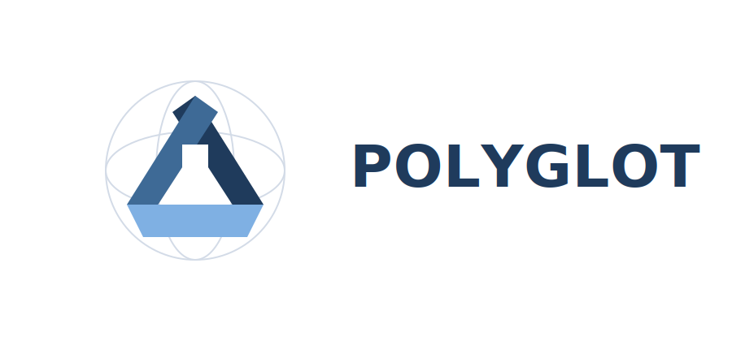

# Polyglot Devcontainers

<p align="center">
  <picture>
    <source media="(prefers-color-scheme: dark)" srcset="assets/polyglot-primary-dark.svg">
    
  </picture>
</p>

<p align="center">
  Open, scenario-driven execution environments for reproducible software development.
</p>

Polyglot Devcontainers is an open execution system built from reproducible
devcontainers, a stable task contract, published images, and runnable scenarios
for the workflows this repository owns.

It is designed for teams that want:

- deterministic development environments
- explicit, repeatable engineering workflows
- container-first validation
- AI-compatible execution loops
- reusable starters for Python, Java, Node, and polyglot work

## What This Is

This repository provides:

- starter templates for secure development environments
- documented example workspaces
- published OCI images for focused downstream use
- a maintainer environment for working on the repository itself
- scenario sets that package repeatable learning and recovery flows
- in-container runtime documentation available through `man`

## Why It Exists

Modern software work breaks down when environments drift, workflows vary by
machine, and operational knowledge lives in chat history instead of the system.

Polyglot reduces that entropy by making the execution surface explicit:

- the container defines the environment
- the task contract defines the workflow
- the repository documents what is supported
- published images and scenarios turn working patterns into reusable assets

## What You Can Do Today

Today, you can use this repository to:

- work on Polyglot itself inside a published maintainer container
- start a new repository from a secure Python, Java, Node, or polyglot template
- consume published starter images directly in downstream devcontainers
- run repo-owned scenarios for dependency maintenance, policy-aware scanning,
  and Podman plus DevPod setup on macOS
- use the same task-based workflow locally, in containers, and in CI

## Task Contract

Every maintained environment in this repository centers on the same contract:

```bash
task init
task lint
task test
task scan
task ci
```

This is the main working interface for humans and agents.

Some environments also expose focused extensions such as:

```bash
task upgrade
task deps:report
```

when that workflow has been explicitly proven for that environment.

## Quick Start

### 1. Work On This Repository

1. Open the repository in VS Code.
2. Reopen it in the devcontainer.
3. Run:

```bash
task ci
man polyglot
```

Use this path when you want the full maintainer environment and repository
validation flow.

### 2. Start From A Template

Choose a starter from [templates](./templates/README.md):

- [python-secure](./templates/python-secure/README.md)
- [python-api-secure](./templates/python-api-secure/README.md)
- [node-secure](./templates/node-secure/README.md)
- [python-node-secure](./templates/python-node-secure/README.md)
- [java-secure](./templates/java-secure/README.md)

Open the copied starter in a devcontainer, then run `task ci`.

### 3. Explore A Working Example Or Scenario

Use [examples](./examples/README.md) when you want a prewired workspace that
shows the contract, images, and docs in practice.

Use [scenario docs](./docs/scenarios/README.md) when you want guided, runnable
flows around a specific problem such as dependency maintenance or security
policy review.

## Core Concepts

### Devcontainers Define The Environment

The container is the source of truth. Tooling, runtimes, scanners, and task
entry points live inside the environment being validated.

### The Task Contract Defines The Workflow

Polyglot keeps the working surface small and explicit. Validation should happen
through the contract instead of ad hoc shell sequences.

### Published Images Extend The Contract

The repository publishes focused images for downstream consumption and a
broader maintainer image for repository work and CI parity.

### Scenarios Package Runnable Knowledge

Scenarios do not replace the task contract. They package repeatable situations
into runnable, documented flows tied to the environments this repository owns.

### Runtime Documentation Lives In The Container

Key guidance is available inside the environment itself through `man`, so
operators do not need to recover essential context from external websites or
chat history.

## Templates, Examples, And Scenarios

### Templates

Use [templates](./templates/README.md) when you want to start a new repository
with a reproducible execution environment.

### Examples

Use [examples](./examples/README.md) when you want a working environment that
teaches the system:

- [python-image-example](./examples/python-image-example/README.md)
- [java-image-example](./examples/java-image-example/README.md)
- [python-maintenance-example](./examples/python-maintenance-example/README.md)
- [java-maintenance-example](./examples/java-maintenance-example/README.md)

### Scenarios

Current scenario families include:

- [dependency-maintenance](./scenarios/dependency-maintenance/README.md):
  repo-owned Python and Java maintenance flows
- [security-policy](./scenarios/security-policy/README.md): policy-aware Python
  package audit review
- [podman-devpod-macos](./scenarios/podman-devpod-macos/README.md): Docker-free
  Podman plus DevPod setup for macOS

Scenario documentation is collected under [docs/scenarios](./docs/scenarios/README.md).

## Published Images

Current published images:

- [`ghcr.io/senanayake/polyglot-devcontainers-maintainer`](https://github.com/senanayake/polyglot-devcontainers/pkgs/container/polyglot-devcontainers-maintainer)
- [`ghcr.io/senanayake/polyglot-devcontainers-java`](https://github.com/senanayake/polyglot-devcontainers/pkgs/container/polyglot-devcontainers-java)
- [`ghcr.io/senanayake/polyglot-devcontainers-python-node`](https://github.com/senanayake/polyglot-devcontainers/pkgs/container/polyglot-devcontainers-python-node)

The maintainer image is for working on this repository and preserving CI parity.
The starter images are the recommended downstream base images.

The recent releases table below is maintained automatically by the release
workflow.

<!-- recent-releases:start -->
## Recent Releases

Recent published release notes are available here:

| Version | Date | Release Notes |
| --- | --- | --- |
| `v0.0.17` | 2026-03-24 | [v0.0.17](https://github.com/senanayake/polyglot-devcontainers/releases/tag/v0.0.17) |
| `v0.0.16` | 2026-03-23 | [v0.0.16](https://github.com/senanayake/polyglot-devcontainers/releases/tag/v0.0.16) |
| `v0.0.13` | 2026-03-23 | [v0.0.13](https://github.com/senanayake/polyglot-devcontainers/releases/tag/v0.0.13) |
| `v0.0.11` | 2026-03-23 | [v0.0.11](https://github.com/senanayake/polyglot-devcontainers/releases/tag/v0.0.11) |
| `v0.0.10` | 2026-03-22 | [v0.0.10](https://github.com/senanayake/polyglot-devcontainers/releases/tag/v0.0.10) |

<!-- recent-releases:end -->

## Project Principles

Short version:

- containers are authoritative
- workflows should be explicit and deterministic
- security belongs in the default path
- composition is preferred over reinvention
- scope should stay honest and reviewable
- behavior should remain visible rather than implicit

See [PROJECT_PRINCIPLES.md](./PROJECT_PRINCIPLES.md) for the full project
principles.

## Documentation

- [Documentation Home](./docs/README.md)
- [Tutorials](./docs/tutorials/README.md)
- [How-To Guides](./docs/how-to/README.md)
- [Reference](./docs/reference/README.md)
- [Explanation](./docs/explanation/README.md)
- [Scenario Docs](./docs/scenarios/README.md)
- [Vision](./VISION.md)
- [Project Principles](./PROJECT_PRINCIPLES.md)

## Contributing

Polyglot welcomes contributions across templates, examples, scenarios,
documentation, release workflows, and repository hardening.

Start here:

- [CONTRIBUTING.md](./CONTRIBUTING.md)
- [COMMUNITY.md](./COMMUNITY.md)
- [GOVERNANCE.md](./GOVERNANCE.md)

## Community

This project is for maintainers, platform teams, open source contributors, and
AI-assisted engineering workflows that need reproducible execution surfaces.

Today, collaboration happens primarily through GitHub issues and pull requests.
See [COMMUNITY.md](./COMMUNITY.md) for participation paths and direction.

## Roadmap

The roadmap lives in [ROADMAP.md](./ROADMAP.md).

It remains important, but it is intentionally below the working identity and
entry points of the project.
