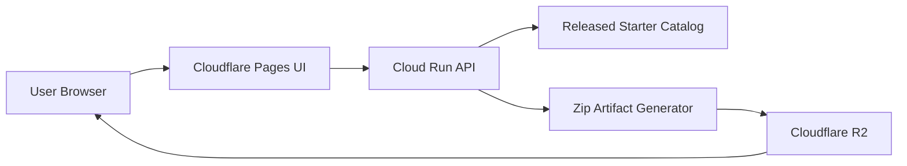

# Starter Generator Deployment Brief

This brief turns the current starter-generator prototype into a public internet
deployment plan.

The goal is not to expose the local maintainer workflow directly. The goal is
to publish a hardened derivative that:

- lets users discover proven starter combinations
- returns downloadable starter projects
- protects the service from abuse and runaway cost
- preserves the maintainer container as the authoritative proof path

## Current Starting Point

Today the starter product surface is intentionally thin:

- [starter catalog](../../starters/catalog.toml)
- [generator and proof engine](../../scripts/starter_catalog.py)
- [local website service](../../scripts/starter_site.py)
- [local site lifecycle manager](../../scripts/manage_starter_site.py)
- [local UI](../../starters/site/index.html)

The public service should reuse the same catalog contract, but it should not
reuse the local trust model. The local site can write arbitrary folders under
the repo and is intentionally developer-friendly. A public deployment must
instead generate bounded zip artifacts from a fixed allowlist.

## Product Shape

The public starter site should expose three product capabilities:

1. Browse the starter catalog.
2. Generate a starter artifact from a released catalog version.
3. Download the generated artifact directly.

It should not expose:

- arbitrary filesystem paths
- maintainer proof commands
- mutable unpublished starter definitions
- arbitrary template composition outside curated profiles

## Hosting Options

### Option A: Cloudflare Pages + Workers + R2

This is the best long-term fit.

Why it fits:

- the UI is mostly static
- static asset delivery is free and unlimited on Cloudflare's assets path
- dynamic generation can run in Workers on a small paid baseline
- generated zip artifacts fit naturally in R2 object storage
- the platform already includes strong edge protections and easy bot controls

Current pricing signals:

- Workers paid plan starts at `$5/month`
- static asset requests are free and unlimited
- Workers standard includes `10 million` requests and `30 million` CPU
  milliseconds per month before overage
- R2 includes a free tier and then low storage cost with no internet egress fee

Trade-off:

- best cost and global delivery profile
- requires porting generation to a Worker-friendly implementation if Python
  remains the current generator language

### Option B: Cloud Run API + Cloudflare Pages UI + R2 Cache

This is the best near-term fit.

Why it fits:

- the current generator is already Python
- Cloud Run can host the existing generator logic with minimal rewrite
- Cloudflare Pages can host the static UI cheaply
- R2 can store and serve generated zip artifacts without egress surprises

Current pricing signals:

- Cloud Run request-based services include `2 million` free requests per month
- the free tier also includes `180,000` vCPU-seconds and `360,000` GiB-seconds
- request-based billing only charges while handling requests

Trade-off:

- fastest path from the current implementation
- split-platform deployment is slightly more operationally complex than an
  all-Cloudflare target

### Option C: Render Static Site + Render Web Service

This is the simplest single-provider fallback.

Why it fits:

- static sites are `$0/month`
- Python web services can start on Render's free instance type
- managed TLS, custom domains, and DDoS protection are already included

Trade-off:

- low operational friction
- less cost-efficient and less globally edge-native than the Cloudflare target
  once generation/download traffic grows

### Option D: Railway

This is a good developer-experience option, but not the strongest default.

Why it fits:

- very easy to deploy
- pricing is straightforward: flat plan plus actual resource usage

Trade-off:

- solid for fast launches
- less attractive than Cloud Run for a Python generator API and less attractive
  than Cloudflare for a globally cached starter-download surface

### Options To Avoid As The Primary Public Surface

- GitHub Pages: good for a brochure or docs site, but not a real generator
  service. GitHub Pages has a soft `100 GB/month` bandwidth limit and is not
  intended to host a SaaS-style product.
- Vercel or Netlify as the primary backend: both can work, but neither is the
  clearest cost or architecture fit for this service shape.

## Recommended Architecture

### Near-Term Launch

Use:

- `Cloudflare Pages` for the public UI
- `Cloud Run` for the generation API
- `Cloudflare R2` for downloadable zip artifact storage
- Cloudflare DNS, TLS, and edge protections in front of the site

This is the fastest path because it preserves Python for generation while
moving public traffic onto a production-grade internet surface.



### Long-Term Target

Use:

- `Cloudflare Pages` or Workers static assets for the UI
- `Cloudflare Workers` for catalog reads and starter generation
- `Cloudflare R2` for artifact storage and download delivery

This becomes the best steady-state model once generation logic is lightweight
enough to run well inside Workers.

## Public API Shape

The public service should stay small.

Recommended endpoints:

- `GET /api/catalog`
- `GET /api/catalog/:version`
- `POST /api/generate`
- `GET /api/download/:artifact_id`
- `GET /healthz`

Recommended `POST /api/generate` contract:

```json
{
  "catalog_version": "v0.0.27",
  "starter": "python-node-secure",
  "profile": "polyglot-default",
  "mode": "published-image-bootstrap"
}
```

Recommended response shape:

```json
{
  "artifact_id": "st_01...",
  "catalog_version": "v0.0.27",
  "starter": "python-node-secure",
  "profile": "polyglot-default",
  "mode": "published-image-bootstrap",
  "download_url": "https://start.polyglot.dev/api/download/st_01...",
  "expires_at": "2026-04-29T18:00:00Z"
}
```

The public API should reject:

- unknown starter ids
- unknown profiles
- unpublished catalog versions
- arbitrary output directories
- proof-only or maintainer-only modes

## Hardening Requirements

### Request Hardening

- allow only released starter ids, profiles, and generation modes
- pin all generation to a released catalog version
- rate-limit `POST /api/generate`
- add Turnstile or equivalent bot challenge to generation requests
- cap artifact size and generation time

### Data Hardening

- generate into ephemeral temp storage only
- package only the generated workspace into a zip
- store downloads in object storage with short retention
- never expose server filesystem paths in public responses

### Supply-Chain Hardening

- each artifact should carry:
  - catalog version
  - source git SHA
  - generation timestamp
  - starter/profile/mode metadata
- publish only from a released catalog, not from branch state
- keep the public service unable to mutate the catalog

### Abuse Controls

- pre-generate popular combinations after each release
- serve cached artifacts when available
- rate-limit repeated identical generation bursts
- enforce per-IP and per-token request quotas

## Recommended Release Model

The internet-facing site should follow release snapshots, not branch state.

Recommended flow:

1. Merge and prove starter changes in the repository.
2. Tag a release.
3. Export a released catalog snapshot.
4. Pre-generate popular artifacts for that release.
5. Deploy the updated UI and API.

This keeps the public service stable even while the repository continues to
evolve.

## Recommended MVP Scope

Start with:

- released catalog browse
- starter generation for curated starter/profile pairs
- zip download delivery
- one public domain such as `start.polyglot.dev`

Do not start with:

- arbitrary feature builders
- public proof orchestration
- user accounts
- persistent project editing in-browser

## Operational Order

### Phase 1

Launch a hosted derivative with:

- static UI
- Python generation API
- downloadable zip artifacts
- released catalog snapshots only

Recommended platform:

- Cloudflare Pages + Cloud Run + R2

### Phase 2

Add:

- artifact caching
- pre-generated popular starters
- rate limits and bot controls
- download analytics

### Phase 3

Evaluate full Cloudflare consolidation:

- port generation to Workers if the generator surface stays small and bounded
- keep proof and catalog authoring inside the maintainer/container workflow

## Decision

The best deployment order is:

1. Launch on `Cloud Run + Cloudflare Pages + R2`
2. Harden the public API around released catalog snapshots and downloadable zip
   artifacts
3. Migrate generation toward `Workers + R2` only after the hosted contract is
   stable and the Python rewrite cost is justified

That order preserves momentum without prematurely forcing a runtime rewrite.

## Sources

- Cloudflare Workers pricing:
  [developers.cloudflare.com/workers/platform/pricing](https://developers.cloudflare.com/workers/platform/pricing/)
- Cloudflare static asset billing:
  [developers.cloudflare.com/workers/static-assets/billing-and-limitations](https://developers.cloudflare.com/workers/static-assets/billing-and-limitations/)
- Cloudflare R2 pricing:
  [developers.cloudflare.com/r2/pricing](https://developers.cloudflare.com/r2/pricing/)
- Cloudflare Turnstile:
  [developers.cloudflare.com/turnstile](https://developers.cloudflare.com/turnstile/)
- Google Cloud Run pricing:
  [cloud.google.com/run/pricing](https://cloud.google.com/run/pricing?hl=en)
- Render pricing:
  [render.com/pricing](https://render.com/pricing)
- Render static sites:
  [render.com/docs/static-sites](https://render.com/docs/static-sites)
- Render DDoS protection:
  [render.com/docs/ddos-protection](https://render.com/docs/ddos-protection)
- Railway pricing:
  [docs.railway.com/pricing](https://docs.railway.com/pricing)
- GitHub Pages limits:
  [docs.github.com/pages/getting-started-with-github-pages/github-pages-limits](https://docs.github.com/en/pages/getting-started-with-github-pages/github-pages-limits)
- Vercel pricing:
  [vercel.com/pricing](https://vercel.com/pricing)
- Netlify pricing:
  [netlify.com/pricing](https://www.netlify.com/pricing/)
